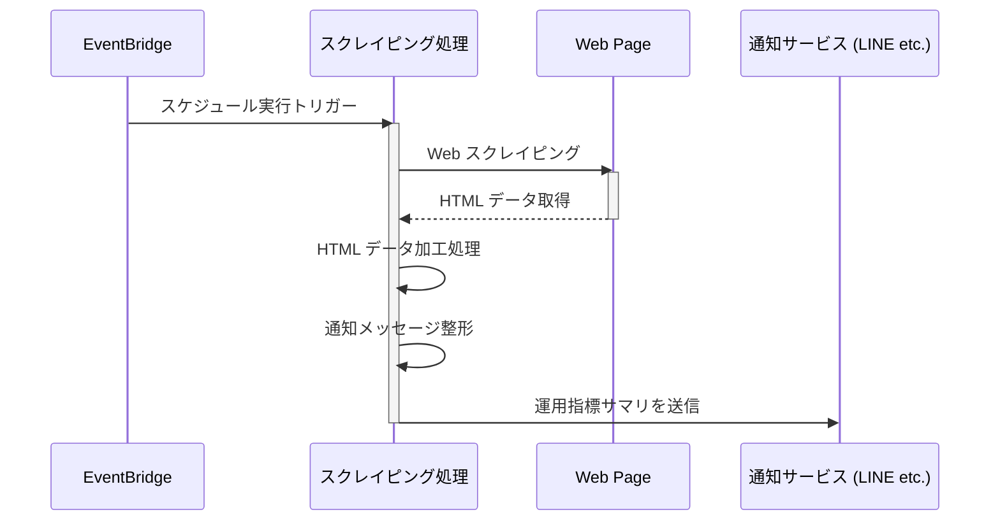
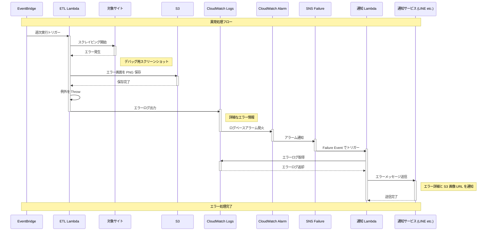

# dcp-ops-monitor

このシステムは、確定拠出年金 (Defined Contribution Plan) の運用状況の管理を楽にする為、
週次で確定拠出年金 Web ページをスクレイピングし、運用指標をサマリして通知します。

※運用商品の見直しなどの操作には、対応していません。

構成及び、処理の流れは下記のとおりです。

## 構成
### 構成図

## 処理シーケンス
## スクレイピング Lambda 処理シーケンス
TODO: 実装後に更新する。エラー時の処理含めて書く

## エラー通知 Lambda 処理シーケンス
TODO: 実装後に書き直す

