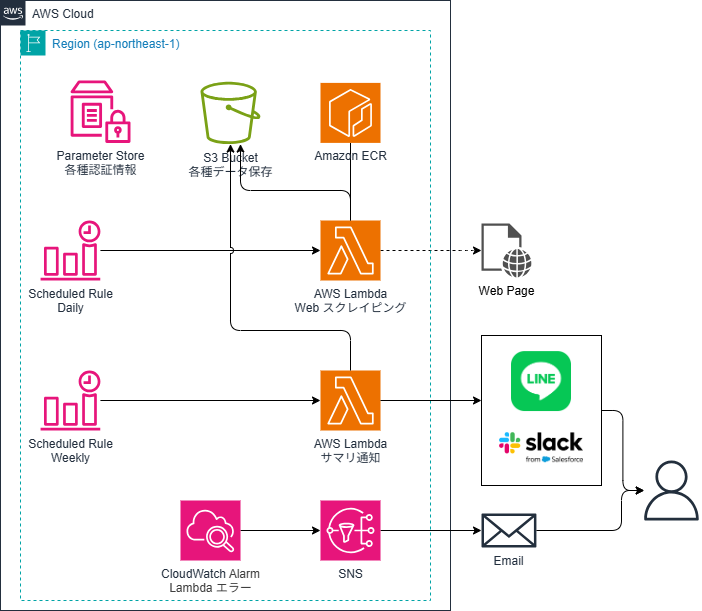

# dcp-ops-monitor

このシステムは、確定拠出年金 (Defined Contribution Plan) の運用状況の管理を楽にする為、
平日に確定拠出年金 Web ページをスクレイピングし、資産情報を Google Spreadsheet に蓄積するとともに、
週次で運用サマリを LINE に通知します。

※運用商品の見直しなどの操作には、対応していません。

アーキテクチャの詳細は [ARCHITECTURE.md](ARCHITECTURE.md) を参照してください。

## 構成図

