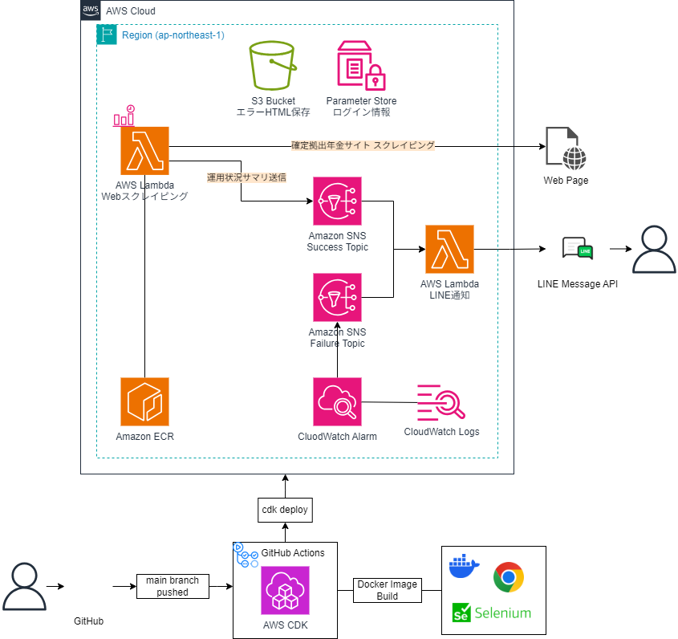

# dcp-ops-monitor

## Description

確定拠出年金 (Defined Contribution Plan) の運用状況を確認する為、
日本レコードキーピング (NRK) が提供する Web ページをスクレイピングし、サマリした情報を通知する。

## Architecture

### Architecture Diagram



### Directory

レイヤードアーキテクチャを採用している

```
|- bin
|- lib
|- lambda
|  |- dcp_etl             # ETL 機能
|    |- src
|      |- application     # アプリケーション層
|      |- domain          # ドメイン層
|      |- infrastructure  # インフラ層
|      |   |- aws           # AWS リソース
|      |   |- scraping      # スクレイピング
|      |- settings        # 設定
|  |- dcp_notification    # 通知機能
```

### Flow

- dcp_etl

  1. 対象ページをスクレイピング・ HTML データ抽出処理<br>
     エラー発生時は、エラー画面を PNG 形式で S3 に保存
  2. HTML データ加工処理
  3. 結果を通知
     SNS Topic (Success) へ送信

- dcp_notification

  1. SNS Topic (Success/Failure) からトリガー・バリデーション<br>
     Failure からの場合、SNS から受信した Event から対象のエラーログメッセージを取得する (https://qiita.com/onooooo/items/f59c69e30dc5b477f9fd)
  2. Message Event を LINE に通知

## Development

### cdk 開発環境の構築 (初回のみ)

[CDK 開発者ガイド](https://docs.aws.amazon.com/ja_jp/cdk/v2/guide/getting_started.html)

- 環境のブートストラップ

```
$ cdk bootstrap aws://ACCOUNT-NUMBER/REGION --profile xxx
```

### 開発環境の準備

#### 前提条件

以下のソフトウェアがインストールされていること

- `Node.js`: v21.7.0 以上
- `Python`: 3.13 以上
- `uv`
- `Docker`

#### 環境変数の設定

1. サンプルの環境変数ファイルをコピーします

```bash
$ cp .env.example .env
```

2. テキストエディタで`.env`ファイルを開きます

3. 以下の環境変数を適切な値で設定します
   本番環境へのデプロイは GitHub Actions を介して行う為、GitHub に変数を設定しておくこと

- `LOG_LEVEL`: アプリケーションのログレベル
- `LOGIN_URL`: スクレイピング対象サイトのログインページ
- `USER_ID`: ログイン用ユーザ ID
- `PASSWORD`: ログイン用パスワード
- `BIRTHDATE`: ログイン用生年月日
- `USER_AGENT`: スクレイピングで使用するユーザーエージェント
- 以下は LINE 通知関数用 (line_notification) 設定の設定
  - `LINE_NOTIFY_URL`: LINE Messaging API の URL
  - `LINE_NOTIFY_TOKEN`: LINE Messaging API の TOKEN

#### Node 環境のセットアップ

```bash
$ npm ci
```

#### Python 実行環境のセットアップ

1. uv インストール

- 仮想環境を使用している場合、仮想環境へ切り替え (Pyenv の例)
  - 仮想環境を使用しない場合は手順スキップ

```bash
$ pyenv install 3.13
$ pyenv versions
# インストールされた Python バージョンへ切り替え
$ pyenv local 3.13.xx
```

- uv インストール

```bash
$ pip install uv
```

2. 依存関係のインストール

```bash
$ uv sync --package dcp_etl
```

### ローカルでの開発手順

#### Python インタプリタからインタラクティブに Selenium を使用する

1. selenium/standalone-chrome を起動

```bash
# https://hub.docker.com/r/selenium/standalone-chrome
$ docker run -d -p 4444:4444 -p 7900:7900 --shm-size="2g" selenium/standalone-chrome:latest
```

2. ブラウザに接続

- http://localhost:7900 に接続

  - パスワードは`secret`を入力

3. Python インタプリタから driver を操作

```bash
$ python

>>> import os
>>> from dotenv import load_dotenv
>>> from selenium import webdriver
>>> env_path = os.path.join(os.path.dirname(os.path.dirname(os.getcwd())), ".env")
>>> load_dotenv(env_path)
>>> options = webdriver.ChromeOptions()
>>> options.add_argument(f'--user-agent={os.environ["USER_AGENT"]}')
>>> driver = webdriver.Remote(command_executor='http://localhost:4444/wd/hub', options=options)
>>> driver.get(os.environ["LOGIN_URL"])
# localhost:7900 で、ブラウザが操作されていること
...

# 操作終了時は quit する
>>> driver.quit()
```

### テスト

#### スナップショット

```bash
$ npm run test:cdk
```

#### ユニットテスト

```bash
$ npm run test:unit
```

### コミット

.husky を使用し、コミット時に Lint/Format を自動的に実行します。

### ローカルから Lambda コンテナでハンドラーを実行する

1. docker-compose で起動する

```bash
$ docker compose up -d --build
```

2. 起動した Lambda を呼び出す

```bash
$ curl -d "{}" http://localhost:8080/2015-03-31/functions/function/invocations
```

3. docker-compose を終了する

```bash
$ docker compose down
```

## Development

### デプロイ

```bash
$ npx cdk deploy --profile xxx
```

### デストロイ

```bash
$ npx cdk destroy --profile xxx
```
