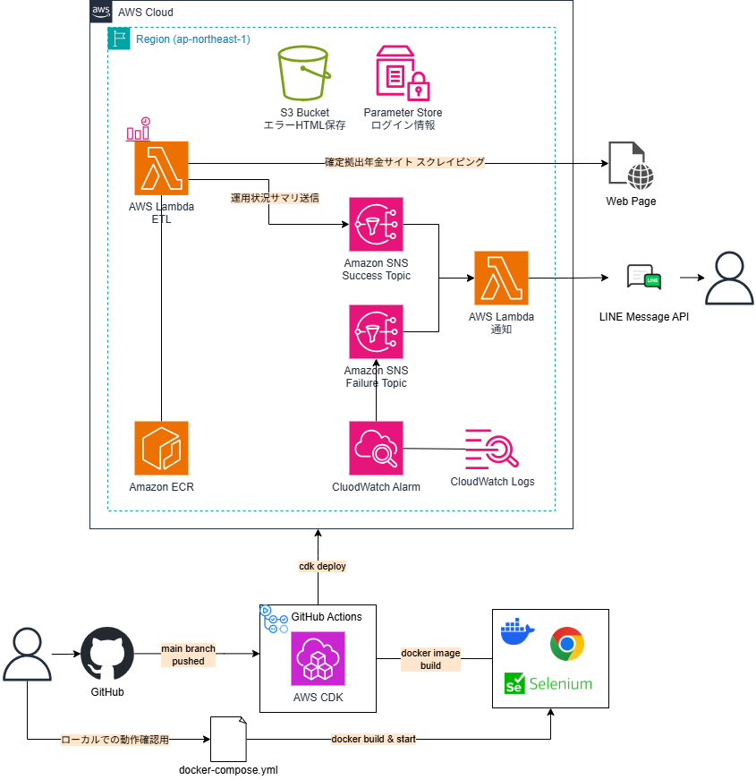

# dcp-ops-monitor

確定拠出年金 (Defined Contribution Plan) の運用状況を確認する為、
週次で対象の Web ページをスクレイピングし、サマリした情報を通知する。

## 構成
### 構成図



### ディレクトリ構成

レイヤードアーキテクチャを意識した以下構成としている

```
|- bin
|- lib
|- lambda
|  |- dcp_etl             # ETL 機能
|    |- src
|      |- application     # アプリケーション層
|      |- domain          # ドメイン層
|      |- infrastructure  # インフラ層
|      |   |- aws           # AWS リソース
|      |   |- scraping      # スクレイピング
|      |- settings        # 設定
|  |- notification    # 通知機能
|- pyproject.toml         # 各機能共通設定 (mypy, ruff など)
```

## 処理シーケンス
## 処理成功時のシーケンス


## 処理失敗時のシーケンス


## 開発

### 前提条件

以下のソフトウェアがインストールされていること

- `Node.js`: v21.7.0 以上
- `Python`: 3.13 以上
- `uv`
- `Docker`

### 開発環境の準備
#### cdk 開発環境の構築 (初回のみ)

[CDK 開発者ガイド](https://docs.aws.amazon.com/ja_jp/cdk/v2/guide/getting_started.html)

- 環境のブートストラップ

```
$ cdk bootstrap aws://ACCOUNT-NUMBER/REGION --profile xxx
```

#### 環境変数の設定

1. サンプルの環境変数ファイルをコピーします

```bash
$ cp .env.example .env
```

2. テキストエディタで`.env`ファイルを開きます

3. 以下の環境変数を適切な値で設定します  
  本番環境へのデプロイは GitHub Actions を介して行う為、GitHub に変数を設定しておくこと

- `LOG_LEVEL`: アプリケーションのログレベル
- `START_URL`: スクレイピング対象サイトのページURL
- `USER_AGENT`: スクレイピングで使用するユーザーエージェント
- 以下は LINE 通知関数用 (line_notification) 設定の設定
  - `LINE_MESSAGE_API_URL`: LINE Messaging API の URL
  - `LINE_MESSAGE_API_TOKEN`: LINE Messaging API の TOKEN

#### Node 環境のセットアップ

```bash
# 依存関係のインストール
$ npm ci
# pre-commit の有効化
$ npx lefthook install
```

#### Python 実行環境のセットアップ

1. uv インストール  
  仮想環境を使用している場合、仮想環境へ切り替え (Pyenv の例)
  仮想環境を使用しない場合は手順スキップ

```bash
$ pyenv install 3.13
$ pyenv versions
# インストールされた Python バージョンへ切り替え
$ pyenv local 3.13.xx
```

  uv インストール

```bash
$ pip install uv
```

2. 依存関係のインストール  
  各プロジェクト毎に依存関係を管理、分離しています

```bash
$ cd lambda/{specific_project_name}
$ uv sync
```

### Lint/Format

```bash
# Lint
$ npm run lint
$ npm run lint:ci

# Format
$ npm run format
$ npm run format:ci
```

### テスト

```bash
# CDK スナップショットテスト
$ npm run test:cdk

# Lambda コードテスト
$ npm run test:unit
```

### コミット

.husky/lefthook を使用し、コミット時に Lint/Format/Test を自動的に実行します。

<details>
<summary>ローカル環境でのETL機能の動作確認方法</summary>

### Python インタプリタからインタラクティブに Selenium を使用する

1. selenium/standalone-chrome を起動

```bash
# https://hub.docker.com/r/selenium/standalone-chrome
$ docker run -d -p 4444:4444 -p 7900:7900 --shm-size="2g" selenium/standalone-chrome:latest
```

2. ブラウザに接続  
  http://localhost:7900 に接続  
  パスワードは`secret`を入力

3. Python インタプリタから driver を操作

```bash
$ python

>>> import os
>>> from dotenv import load_dotenv
>>> from selenium import webdriver
>>> env_path = os.path.join(os.path.dirname(os.path.dirname(os.getcwd())), ".env")
>>> load_dotenv(env_path)
>>> options = webdriver.ChromeOptions()
>>> options.add_argument(f'--user-agent={os.environ["USER_AGENT"]}')
>>> driver = webdriver.Remote(command_executor='http://localhost:4444/wd/hub', options=options)
>>> driver.get(os.environ["START_URL"])
# localhost:7900 で、ブラウザが操作されていること
...

# 操作終了時は quit する
>>> driver.quit()
```

### Lambda コンテナでハンドラーを実行する
TODO: SNS_TOPIC_ARN, ParameterStoreのARNをENVに設定する、もしくはLOGIN_USER_IDなどセットしておけば動作することを追記する
TODO: デプロイされていないと動かないので、通知機能含めて動作確認できるように...

1. docker-compose で起動する

```bash
$ docker compose up -d --build
```

2. 起動した Lambda を呼び出す

```bash
$ curl -d "{}" http://localhost:8080/2015-03-31/functions/function/invocations
```

3. docker-compose を終了する

```bash
$ docker compose down
```

</details>

## デプロイ

### 事前作業

1. ログイン用パラメータを格納する ParameterStore を手動で作成します (CDK で暗号化文字列を使用したパラメータを作成できない為手動としています)
```json
{"LOGIN_USER_ID":"xxxx","LOGIN_PASSWORD":"xxxx","LOGIN_BIRTHDATE":"19701201"}
```

2. 作成したパラメータ名を loginParameterName にセットします

### デプロイ

[GitHub Actions ワークフロー](.github/workflows/)を利用してデプロイします
