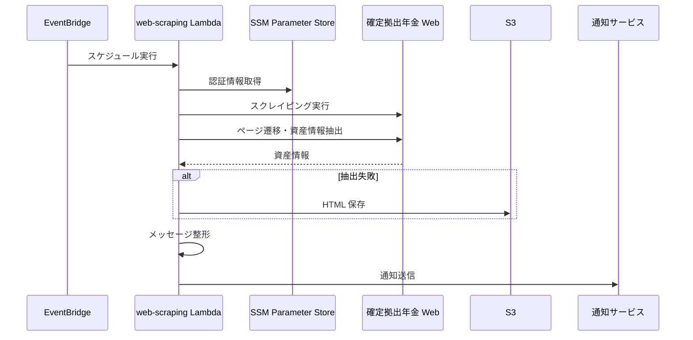
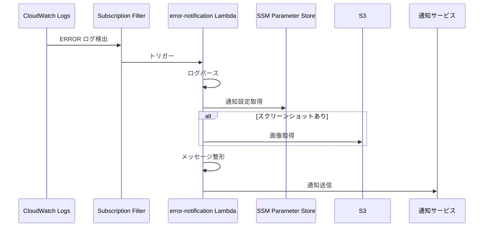

# 機能設計書

## システム構成図


システムは AWS 上で動作し、以下のコンポーネントで構成されます。

---

## 機能アーキテクチャ

### 運用状況通知機能 (web-scraping)

EventBridge によるスケジュール実行で起動し、確定拠出年金 Web ページをスクレイピングして運用指標を取得・通知します。



**使用する AWS サービス**:
- EventBridge: スケジュール実行
- Lambda (Docker): スクレイピング処理
- SSM Parameter Store: 認証情報の保存
- S3: エラー時の HTML/スクリーンショット保存

### エラー通知機能 (error-notification)

CloudWatch Logs Subscription Filter により、ERROR ログを検知して自動起動します。



**使用する AWS サービス**:
- CloudWatch Logs: ログ保存・監視
- Subscription Filter: ERROR ログの検知
- Lambda: 通知処理
- SSM Parameter Store: 通知設定の保存
- S3: スクリーンショットの取得

---

## データモデル定義

### 運用状況通知機能

#### DcpAssetInfo（資産評価情報）

単一の資産評価情報を表すモデル。

| フィールド | 型 | 説明 |
|-----------|-----|------|
| cumulative_contributions | int | 拠出金額累計 |
| gains_or_losses | int | 評価損益 |
| asset_valuation | int | 資産評価額 |

#### DcpAssets（資産情報）

総合評価と商品別評価を保持するモデル。

| フィールド | 型 | 説明 |
|-----------|-----|------|
| total | DcpAssetInfo | 総評価額 |
| products | dict[str, DcpAssetInfo] | 商品別資産（商品名をキーとする） |

#### DcpOpsIndicators（運用指標）

| フィールド | 型 | 説明 |
|-----------|-----|------|
| operation_years | float | 運用年数 |
| actual_yield_rate | float | 運用利回り |
| expected_yield_rate | float | 目標利回り |
| total_amount_at_60age | int | 想定受取額（60歳） |

### エラー通知機能

#### ErrorRecord（エラーログレコード）

| フィールド | 型 | 説明 |
|-----------|-----|------|
| level | str | ログレベル（"ERROR"） |
| location | str | エラー発生箇所 |
| message | str | エラーメッセージ本文 |
| service | str | サービス名 |
| timestamp | datetime | タイムスタンプ（UTC） |
| jst_timestamp | datetime | タイムスタンプ（JST、算出プロパティ） |
| error_screenshot_key | str \| None | スクリーンショットの S3 キー |
| error_html_key | str \| None | HTML ファイルの S3 キー |
| exception_name | str \| None | 例外クラス名 |

#### ErrorLogEvents（エラーログイベント）

| フィールド | 型 | 説明 |
|-----------|-----|------|
| error_records | list[ErrorRecord] | エラーレコードのリスト |
| logs_url | str \| None | CloudWatch Logs の URL |

---

## コンポーネント設計

各 Lambda はクリーンアーキテクチャに基づいた 4 層構造で実装されています。

```
lambda/{feature}/src/
├── handler.py              # Lambda エントリーポイント
├── config/
│   └── settings.py         # 環境設定管理
├── presentation/
│   └── *.py                # Lambda イベント処理、依存性注入
├── application/
│   └── *.py                # ビジネスロジック
├── domain/
│   ├── {domain}_object.py    # ドメインモデル（ドメイン知識単位）
│   ├── {domain}_interface.py # インターフェース定義（ドメイン知識単位）
│   └── exceptions.py         # ドメイン例外
└── infrastructure/
    └── *.py                # AWS サービス実装、外部 API 連携
```

### 各レイヤーの責務

- **Presentation**: Lambda イベント受け取り、依存性注入、レスポンス返却
- **Application**: 複数のドメインモデルを組み合わせた業務ロジック実行
- **Domain**: ビジネスルールとモデル定義（外部依存なし）
- **Infrastructure**: AWS サービスや外部 API との連携

### 依存関係の方向

```
Presentation → Application → Domain ← Infrastructure
```

- Domain 層は他の層に依存しない
- Application 層は Domain 層のみに依存
- Infrastructure 層は Domain 層のみに依存
- Presentation 層が依存性注入を行い、各層を結合

---

## インターフェース設計

### 運用状況通知機能

#### IScraper（スクレイピングインターフェース）

ページ遷移と資産情報抽出を抽象化。

```python
def fetch_asset_valuation(self) -> DcpAssets:
    """資産評価情報を取得（ページ遷移・要素抽出を一括で行う）"""
```

#### INotifier（通知インターフェース）

通知送信を抽象化。

```python
def send(self, message: NotificationMessage) -> None:
    """通知を送信"""
```

#### IObjectRepository（オブジェクト保存インターフェース）

S3 へのオブジェクト保存を抽象化。

```python
def put(self, key: str, data: bytes, content_type: str) -> None:
    """オブジェクトを保存"""
```

### エラー通知機能

#### IErrorLogParser（ログパースインターフェース）

CloudWatch Logs イベントのパースを抽象化。

```python
def parse(self, event: dict) -> ErrorLogEvents:
    """CloudWatch Logs イベントをパース"""
```

---

## 外部 API

### LINE Messaging API

通知送信に使用。Push Message API を利用してテキストメッセージを送信します。

- エンドポイント: `https://api.line.me/v2/bot/message/push`
- 認証: Channel Access Token（Bearer）
- メッセージ形式: JSON

---

## エラーハンドリング

### 運用状況通知機能

| 例外 | 発生条件 | 対応 |
|------|---------|------|
| ScrapingFailed | スクレイピング失敗（ページ遷移・抽出） | スクリーンショット/HTML 保存、ERROR ログ出力 |
| ArtifactUploadError | エラーアーティファクトの S3 アップロード失敗 | ERROR ログ出力 |
| NotificationFailed | 通知送信失敗 | ERROR ログ出力、Lambda リトライ |

### エラー通知機能

| 例外 | 発生条件 | 対応 |
|------|---------|------|
| CloudWatchLogsParseError | ログパース失敗 | ERROR ログ出力、Lambda 失敗 |
| LineNotificationError | 通知送信失敗 | ERROR ログ出力、Lambda リトライ |
