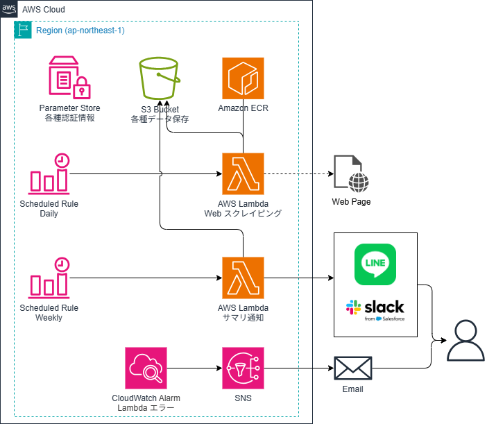
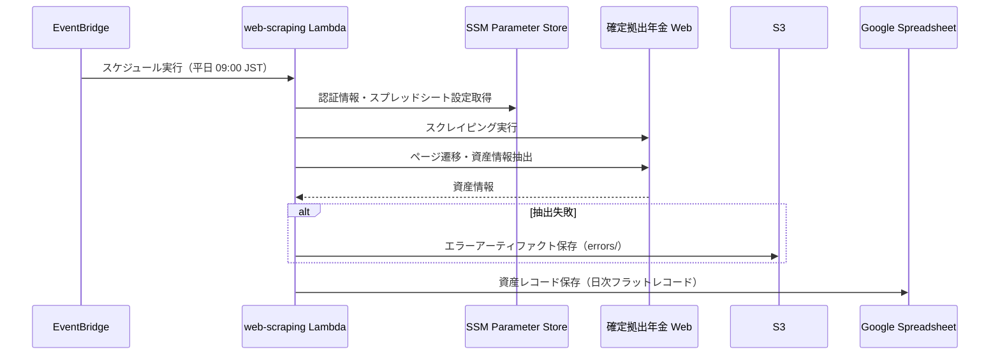
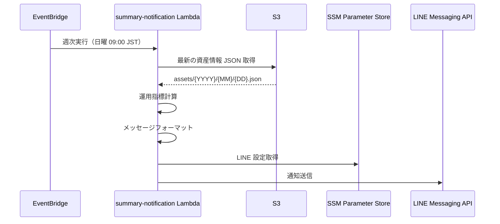

# 機能設計書

## システム構成図



システムは AWS 上で動作し、以下のコンポーネントで構成されます。

---

## 機能アーキテクチャ

### 資産情報収集機能 (web-scraping)

EventBridge によるスケジュール実行で起動し、確定拠出年金 Web ページをスクレイピングして資産情報を取得・Google Spreadsheet に保存します。



**使用する AWS サービス**:
- EventBridge: スケジュール実行（平日のみ）
- Lambda (Docker): スクレイピング処理
- SSM Parameter Store: 認証情報・スプレッドシート設定の保存
- S3: エラー時の HTML/スクリーンショット保存

**使用する外部サービス**:
- Google Spreadsheet: 資産レコードの蓄積（gspread + サービスアカウント認証）

### サマリ通知機能 (summary-notification)

EventBridge による週次スケジュール実行で起動し、S3 から最新の資産情報を取得して運用指標を計算し、サマリを通知します。



**使用する AWS サービス**:
- EventBridge: 週次スケジュール実行（日曜のみ）
- Lambda: サマリ通知処理（Python ランタイム）
- S3: 資産情報の取得
- SSM Parameter Store: LINE 設定の保存

---

## データモデル定義

### 共通（shared パッケージ）

#### DcpAssetInfo（資産評価情報）

単一の資産評価情報を表すモデル。

| フィールド | 型 | 説明 |
|-----------|-----|------|
| cumulative_contributions | int | 拠出金額累計 |
| gains_or_losses | int | 評価損益 |
| asset_valuation | int | 資産評価額 |

#### AssetRecord（資産レコード）

商品別のフラットなレコードモデル。Google Spreadsheet への蓄積に使用。

| フィールド | 型 | 説明 |
|-----------|-----|------|
| date | date | 取得日 |
| product | str | 商品名 |
| asset_valuation | int | 資産評価額 |
| cumulative_contributions | int | 拠出金額累計 |
| gains_or_losses | int | 評価損益 |

### サマリ通知機能

#### DcpAssets（資産情報）

総合評価と商品別評価を保持するモデル。summary-notification ローカルで定義。

| フィールド | 型 | 説明 |
|-----------|-----|------|
| total | DcpAssetInfo | 総評価額 |
| products | dict[str, DcpAssetInfo] | 商品別資産（商品名をキーとする） |

#### DcpOpsIndicators（運用指標）

| フィールド | 型 | 説明 |
|-----------|-----|------|
| operation_years | float | 運用年数 |
| actual_yield_rate | float | 運用利回り |
| expected_yield_rate | float | 目標利回り（固定 0.06） |
| total_amount_at_60age | int | 想定受取額（60歳） |

---

## コンポーネント設計

各 Lambda はクリーンアーキテクチャに基づいた 4 層構造で実装されています。
共通コードは uv workspace の shared パッケージで管理しています。

```
lambda/
├── shared/src/shared/          # 共通パッケージ
│   ├── config/                 # 共通設定（Logger、BaseSettings）
│   ├── domain/                 # 共通ドメインモデル（DcpAssetInfo、AssetRecord、IAssetRecordRepository）
│   └── infrastructure/         # 共通インフラ（SSM Parameter Store）
├── {feature}/src/
│   ├── handler.py              # Lambda エントリーポイント
│   ├── config/
│   │   └── settings.py         # 環境設定管理（shared を継承）
│   ├── presentation/
│   │   └── *.py                # Lambda イベント処理、依存性注入
│   ├── application/
│   │   └── *.py                # ビジネスロジック
│   ├── domain/
│   │   ├── {domain}_object.py    # ドメインモデル（ドメイン知識単位）
│   │   ├── {domain}_interface.py # インターフェース定義（ドメイン知識単位）
│   │   └── exceptions.py         # ドメイン例外
│   └── infrastructure/
│       └── *.py                # AWS サービス実装、外部 API 連携
```

### 各レイヤーの責務

- **Presentation**: Lambda イベント受け取り、依存性注入、レスポンス返却
- **Application**: 複数のドメインモデルを組み合わせた業務ロジック実行
- **Domain**: ビジネスルールとモデル定義（外部依存なし）
- **Infrastructure**: AWS サービスや外部 API との連携

### 依存関係の方向

```
Presentation → Application → Domain ← Infrastructure
```

- Domain 層は他の層に依存しない
- Application 層は Domain 層のみに依存
- Infrastructure 層は Domain 層のみに依存
- Presentation 層が依存性注入を行い、各層を結合

---

## インターフェース設計

### 資産情報収集機能

#### IScraper（スクレイピングインターフェース）

ページ遷移と資産情報抽出を抽象化。

```python
def fetch_asset_valuation(self) -> dict[str, DcpAssetInfo]:
    """資産評価情報を取得（ページ遷移・要素抽出を一括で行う）"""
```

#### IArtifactRepository（アーティファクト保存インターフェース）

S3 へのエラーアーティファクト保存を抽象化。

```python
def save_error_artifact(self, key: str, file_path: str) -> None:
    """エラーアーティファクトを保存する"""
```

#### IAssetRecordRepository（資産レコードリポジトリインターフェース）

資産レコードの保存を抽象化（shared パッケージで定義）。

```python
def save_daily_records(self, records: list[AssetRecord]) -> None:
    """日次の資産レコードを保存する（冪等性を保証）"""
```

### サマリ通知機能

#### IAssetRepository（資産リポジトリインターフェース）

S3 からの資産情報取得を抽象化。

```python
def get_latest_assets(self) -> DcpAssets:
    """最新の資産情報を取得"""
```

#### INotifier（通知インターフェース）

通知送信を抽象化。

```python
def notify(self, messages: list[NotificationMessage]) -> None:
    """通知を送信"""
```

---

## 外部 API

### LINE Messaging API

通知送信に使用。Push Message API を利用してテキストメッセージを送信します。

- エンドポイント: `https://api.line.me/v2/bot/message/push`
- 認証: Channel Access Token（Bearer）
- メッセージ形式: JSON

---

## エラーハンドリング

### 資産情報収集機能

| 例外 | 発生条件 | 対応 |
|------|---------|------|
| ScrapingFailed | スクレイピング失敗（ページ遷移・抽出） | スクリーンショット/HTML 保存（errors/）、ERROR ログ出力 |
| ArtifactUploadError | S3 へのエラーアーティファクト保存失敗 | ERROR ログ出力 |
| AssetRecordError | 資産レコードの保存失敗（Google Spreadsheet） | ERROR ログ出力 |

### サマリ通知機能

| 例外 | 発生条件 | 対応 |
|------|---------|------|
| AssetNotFound | S3 に資産情報がない | ERROR ログ出力 |
| NotificationFailed | 通知送信失敗 | ERROR ログ出力、Lambda リトライ |

---

## 監視設計

各 Lambda 関数のエラーメトリクスを CloudWatch Alarm で監視し、SNS Topic 経由で通知します。

| 監視対象 | メトリクス | 評価期間 | しきい値 | 通知先 |
|---------|----------|---------|---------|-------|
| web-scraping Lambda | Errors | 5 分 | >= 1 | SNS Topic |
| summary-notification Lambda | Errors | 5 分 | >= 1 | SNS Topic |

- データポイントなし（Lambda 未実行）の場合はアラームを発火しない（TreatMissingData: NOT_BREACHING）
