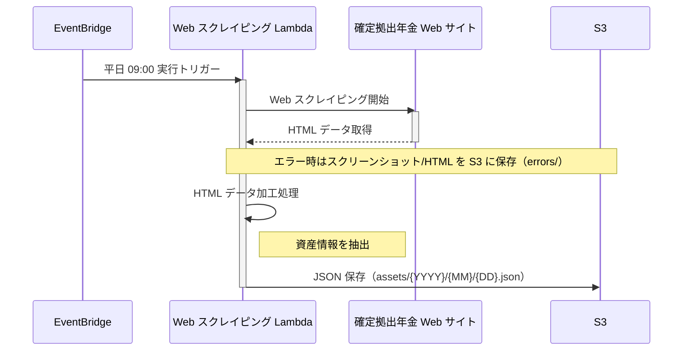
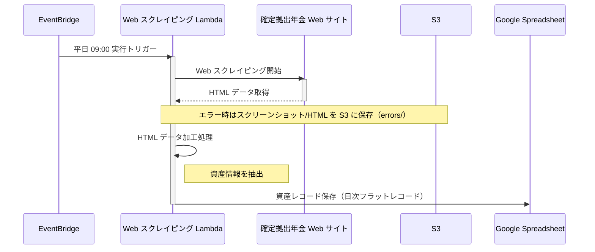

# 設計: ドキュメント最新化 (issue-137)

## 変更方針

各 README の誤記・欠落を最小限の変更で修正する。新規セクションの追加は、既存のスタイル・構成に揃える。

---

## `lambda/web-scraping/README.md` の変更設計

### 1. 主な機能（L12）

**変更前:**
```
- 資産情報の JSON 形式での S3 保存
```

**変更後:**
```
- 資産情報の Google Spreadsheet への保存（日次フラットレコード）
```

### 2. シーケンス図（L17-38）

**変更前:**


**変更後:**


### 3. 環境変数テーブル（L44-51）

`SPREADSHEET_PARAMETER_NAME` を追加し、`DATA_BUCKET_NAME` の説明を明確化する。

**変更前:**
| 環境変数 | 説明 | デフォルト値 |
|---------|------|-------------|
| `SCRAPING_PARAMETER_NAME` | スクレイピングに必要な各種パラメータ（URL、認証情報等）を格納した SSM パラメータ名 | - |
| `DATA_BUCKET_NAME` | データ保存用 S3 バケット名 | - |
| `USER_AGENT` | スクレイピングで使用するユーザーエージェント | - |
| `POWERTOOLS_LOG_LEVEL` | ログレベル (ERROR, WARNING, INFO, DEBUG) | INFO |

**注**: `SCRAPING_PARAMETER_NAME` と `DATA_BUCKET_NAME` は必須です。

**変更後:**
| 環境変数 | 説明 | デフォルト値 |
|---------|------|-------------|
| `SCRAPING_PARAMETER_NAME` | スクレイピングに必要な各種パラメータ（URL、認証情報等）を格納した SSM パラメータ名 | - |
| `SPREADSHEET_PARAMETER_NAME` | Google Spreadsheet の接続設定（スプレッドシート ID、シート名、認証情報等）を格納した SSM パラメータ名 | - |
| `DATA_BUCKET_NAME` | エラーアーティファクト（スクリーンショット/HTML）保存用 S3 バケット名 | - |
| `USER_AGENT` | スクレイピングで使用するユーザーエージェント | - |
| `POWERTOOLS_LOG_LEVEL` | ログレベル (ERROR, WARNING, INFO, DEBUG) | INFO |

**注**: `SCRAPING_PARAMETER_NAME`、`SPREADSHEET_PARAMETER_NAME`、`DATA_BUCKET_NAME` は必須です。

---

## `lambda/summary-notification/README.md` の変更設計

### 1. 機能概要（L8）

**変更前:**
```
- S3 から最新の資産情報 JSON を取得
```

**変更後:**
```
- Google Spreadsheet から最新の資産情報を取得
```

### 2. ディレクトリ構成（L54-56）

**変更前:**
```
└── infrastructure/
    ├── s3_asset_repository.py    # S3 資産リポジトリ
    ├── line_notifier.py          # LINE 通知アダプター
    └── ssm_parameter.py          # SSM パラメータ取得
```

**変更後:**
```
└── infrastructure/
    ├── google_sheet_asset_repository.py  # Google Spreadsheet 資産リポジトリ
    └── line_notifier.py                  # LINE 通知アダプター
```

### 3. 環境変数セクションの追加

web-scraping/README.md のスタイルに合わせ、「## アーキテクチャ」セクションの前に追加する。

```markdown
## 環境変数

この Lambda は以下の環境変数を使用します:

| 環境変数 | 説明 | デフォルト値 |
|---------|------|-------------|
| `LINE_MESSAGE_PARAMETER_NAME` | LINE 通知に必要な各種パラメータ（Channel Access Token、送信先 User ID 等）を格納した SSM パラメータ名 | - |
| `SPREADSHEET_PARAMETER_NAME` | Google Spreadsheet の接続設定（スプレッドシート ID、シート名、認証情報等）を格納した SSM パラメータ名 | - |
| `POWERTOOLS_LOG_LEVEL` | ログレベル (ERROR, WARNING, INFO, DEBUG) | INFO |

**注**: `LINE_MESSAGE_PARAMETER_NAME` と `SPREADSHEET_PARAMETER_NAME` は必須です。
```
