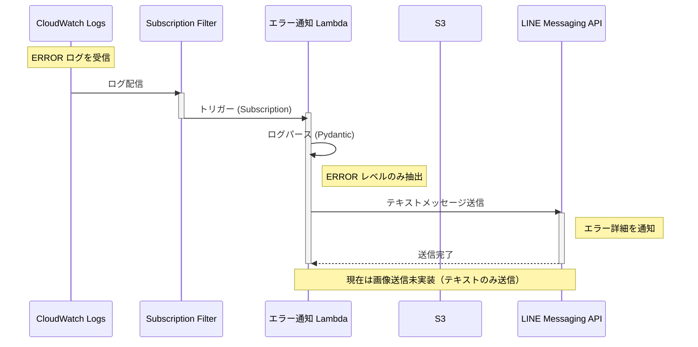

# error-notification Lambda

## 概要

error-notification Lambda は、スクレイピング Lambda で発生したエラーを検知し、LINE Messaging API を通じて通知するための関数です。

## 主な機能

- CloudWatch Logs Subscription Filter をトリガーとして起動
- ERROR レベルのログを自動検知
- ログメッセージをパース・バリデーション（Pydantic 使用）
- LINE Messaging API へテキストメッセージ送信
- エラーハンドリング（S3 画像取得失敗時は テキストのみ送信）

## 処理シーケンス

## 環境変数

この Lambda は以下の環境変数を使用します:

| 環境変数 | 説明 | デフォルト値 |
|---------|------|-------------|
| `LINE_MESSAGE_PARAMETER_NAME` | LINE Message API 接続に必要な URL と Token を格納した SSM パラメータ名 | - |
| `ERROR_BUCKET_NAME` | エラー保存用 S3 バケット名 | - |
| `POWERTOOLS_LOG_LEVEL` | ログレベル (ERROR, WARNING, INFO, DEBUG) | INFO |

**注**: `LINE_MESSAGE_PARAMETER_NAME` と `ERROR_BUCKET_NAME` は必須です。

## 開発ガイド

開発環境のセットアップ、テスト実行、Lint/Format については、[CLAUDE.md](../../CLAUDE.md) を参照してください。

- **ディレクトリ構成**: 「Lambda 共通のディレクトリ構成」セクション
- **テスト戦略**: 「テスト戦略」セクション
- **開発コマンド**: 「開発コマンド」セクション
