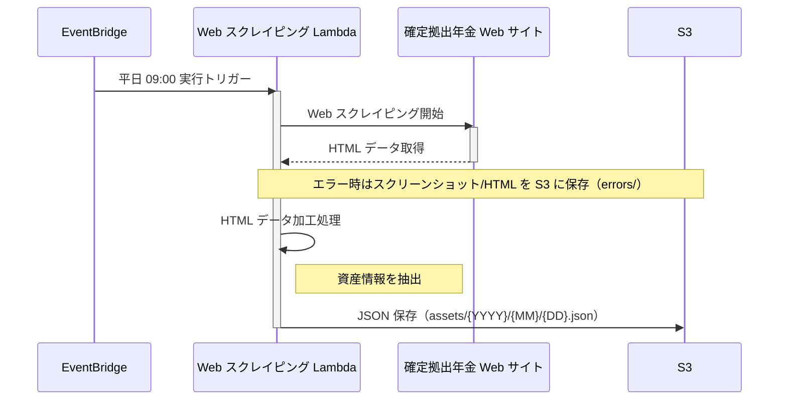

# web-scraping

## 概要

web-scraping 機能は、平日に確定拠出年金の Web ページにアクセスし、資産情報をスクレイピングして S3 に保存します。
Selenium を Lambda で使用する場合、モジュール間の依存関係の調整が煩雑な為、コンテナを使用しています。

## 主な機能

- EventBridge によるスケジュール実行（平日 09:00 JST）
- Selenium を使用した Web スクレイピング
- 資産情報の JSON 形式での S3 保存
- エラー時のスクリーンショット・ HTML 保存（デバッグ用）

## 処理シーケンス



## 環境変数

この Lambda は以下の環境変数を使用します:

| 環境変数 | 説明 | デフォルト値 |
|---------|------|-------------|
| `SCRAPING_PARAMETER_NAME` | スクレイピングに必要な各種パラメータ（URL、認証情報等）を格納した SSM パラメータ名 | - |
| `DATA_BUCKET_NAME` | データ保存用 S3 バケット名 | - |
| `USER_AGENT` | スクレイピングで使用するユーザーエージェント | - |
| `POWERTOOLS_LOG_LEVEL` | ログレベル (ERROR, WARNING, INFO, DEBUG) | INFO |

**注**: `SCRAPING_PARAMETER_NAME` と `DATA_BUCKET_NAME` は必須です。

## 開発ガイド

開発環境のセットアップ、テスト実行、Lint/Format については、[CLAUDE.md](../../CLAUDE.md) を参照してください。

- **ディレクトリ構成**: 「Lambda 共通のディレクトリ構成」セクション
- **テスト戦略**: 「テスト戦略」セクション
- **開発コマンド**: 「開発コマンド」セクション

## ローカル環境でのスクレイピング実行方法

### Python インタプリタからインタラクティブに Selenium を使用する

> [!NOTE]
> スクレイピングの接続先は本物を使用します。

1. selenium/standalone-chrome を起動

```bash
# https://hub.docker.com/r/selenium/standalone-chrome
$ docker run -d -p 4444:4444 -p 7900:7900 --shm-size="2g" selenium/standalone-chrome:latest
```

2. ブラウザに接続
  http://localhost:7900 に接続
  パスワードは`secret`を入力

3. Python インタプリタから driver を操作

```bash
$ python

>>> import os
>>> from dotenv import load_dotenv
>>> from selenium import webdriver
>>> env_path = os.path.join(os.path.dirname(os.path.dirname(os.getcwd())), ".env.local")
>>> load_dotenv(env_path)
>>> options = webdriver.ChromeOptions()
>>> options.add_argument(f'--user-agent={os.environ["USER_AGENT"]}')
>>> driver = webdriver.Remote(command_executor='http://localhost:4444/wd/hub', options=options)
>>> driver.get(os.environ["START_URL"])
# localhost:7900 で、ブラウザが操作されていること
...

# 操作終了時は quit する
>>> driver.quit()
```

### docker-compose で Lambda コンテナを実行する

> [!NOTE]
> Lambda コンテナでスクレイピングが正常に動作するか確認する為使用します。
> AWS リソースについては LocalStack を使用しますが、スクレイピングの接続先は本物を使用します。

1. .env.local を編集する
- `SCRAPING_PARAMETER_VALUE` に実際の認証情報を入力し保存する

2. docker-compose で起動する

```bash
$ docker compose up -d --build
```

3. 起動した Lambda を呼び出す

```bash
$ curl -d "{}" http://localhost:8080/2015-03-31/functions/function/invocations
```

4. docker-compose を終了する

```bash
$ docker compose down
```
